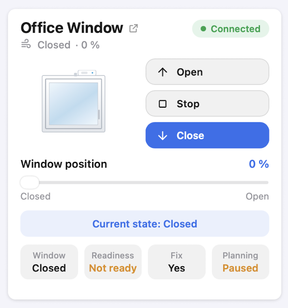
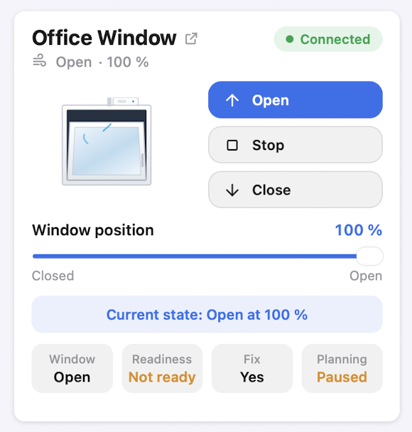
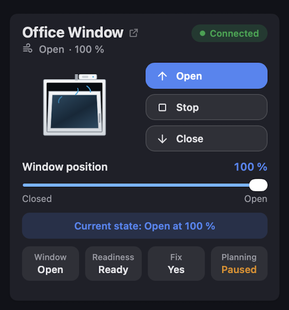
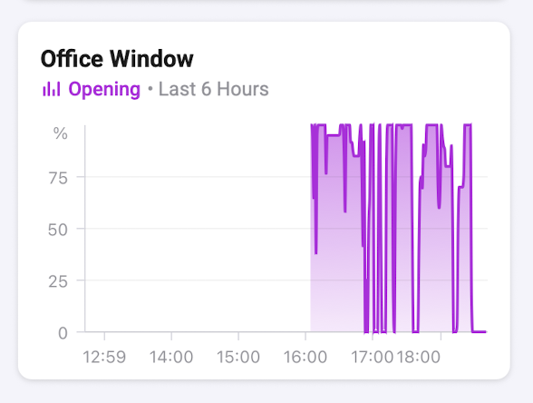
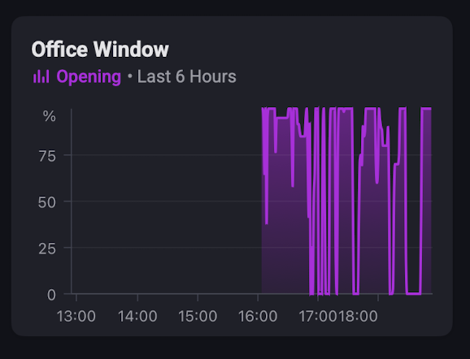

# Vektiva SMARWI — Homey Pro app

Homey Pro app (SDK v3) for **Vektiva SMARWI** window openers. It talks to the device
over your **local network**, with the **vektiva.online** cloud as an optional fallback.

Author: Marian Lojka <marian.lojka@gmail.com> · MIT licence

Submitted to the Homey App Store and currently in certification. Until it goes live it
can be installed from the test channel:
<https://homey.app/a/com.vektiva.smarwi/test/>

## How it connects

```
phone (anywhere on the internet)
   └── Homey cloud ──► Homey Pro (at home, on the LAN)
                          ├── LAN:   http://<ip>/cmd/… + ws://<ip>/ws   ← default route
                          ├── MQTT:  ion/<remote>/%<id>/…               ← optional, state + control
                          └── WAN:   https://vektiva.online/api/…       ← optional, control only
```

Homey Pro is a box in your home and your phone reaches it through the Homey cloud, so
**you do not need the Vektiva cloud to control the window from mobile data** — it is
enough that the SMARWI runs in Wi-Fi *Client* mode on the same network as Homey.
(A SMARWI is either in AP mode for the initial setup, or in Client mode on your Wi-Fi;
switching between them requires a restart.)

The vektiva.online route is there for a SMARWI on a **different network** (a cottage,
a second flat), or when the local route is temporarily down.

## Features

| Feature | Homey capability / card |
|---|---|
| Open, close and open to X % | `windowcoverings_set` + Flow actions *Open to [X] %* / *Close the window* |
| Stop a movement | `smarwi_stop` button + Flow action *Stop the movement* |
| Fix / release the ridge | `smarwi_ridge_inside` switch + Flow actions *Fix the ridge* / *Release the ridge* |
| Raw command (`prio`, `queue`, …) | Flow action *Send a raw command* |
| Opening percentage (logged in Insights) | `smarwi_position` |
| Window held by the device | `smarwi_fixed` |
| Window blocked | `alarm_generic` + Flow trigger *The window got blocked* |
| Wi-Fi signal strength | `smarwi_rssi` |
| Status and control over MQTT | optional, see below |

### Window dashboard widget

<p>
  
  
  
</p>

A custom widget draws the window itself: a top-hung sash that tilts open at the top in
proportion to the current opening, with fresh air streaming in while it is open, and
the SMARWI unit on the frame head with its ridge sliding out.

Next to it sit **Open / Stop / Close**, with the button matching the current position
highlighted, and below everything a button that releases the ridge so the window can be
opened by hand — and fixes it again afterwards. Below are a position slider in steps of 10 %, a state banner, and the four
values the SMARWI itself reports:

| Tile | Source | Values |
|---|---|---|
| Window | `pos` while `s == 250` | Open / Closed / Opening / Closing / Blocked |
| Readiness | `ok` | Ready / Not ready — the ridge is engaged, so the device can move the window |
| Holding | `fix` | Yes / — — the motor is holding the sash **right now** |
| Planning | `a` | Yes (a plan is running) / Paused / No (no plans set) |

State arrives by push, so the widget follows the window in real time. Tapping the
device name opens the SMARWI's own web interface — Homey gives a widget no way to open
a device page, `popup()` is the only navigation it has.

Add it in the Homey app: **Dashboards → edit → + → Vektiva SMARWI → Window**.

The opening percentage is also logged in Insights, so the day can be read back as a
graph:

<p>
  
  
</p>

## The device API

Documented by Vektiva at <https://vektiva.gitlab.io/vektivadocs/api/api.html>:

```
GET http://<ip>/cmd/open          # open fully
GET http://<ip>/cmd/open/40       # open to 40 %
GET http://<ip>/cmd/close
GET http://<ip>/cmd/stop
GET http://<ip>/cmd/fix
GET http://<ip>/statusn           # status, key:value lines
```

`/statusn` answers with, for example:

```
t:swr
s:250
e:0
ro:0
pos:c
fix:1
fw:3.4.1-15-g3d0f
cid:OfficeRoom
rssi:-63
```

Key fields (see `lib/SmarwiApi.js`):

* `s` — state code: `250` idle, `200–219` opening, `220–239` closing,
  `< 200` error or calibration (`10` window locked to the frame, `20` timeout,
  `30` window in horizontal position)
* `e` — error code
* `pos` — `c` closed / `o` open
* `ro` — `1` means the ridge is **not** in the device, so it cannot move the window
* `fix` — the window is held by the device

The SMARWI **does not report a real percentage**, only open or closed, so the app
remembers the position it last asked for and reports that.

### Readiness, and why a command can be swallowed

While the device reports `ok:0` ("not ready" in its own interface), it answers `OK` to a
movement command but only re-engages the ridge — the window does not move and the
request is gone. Engaging takes several seconds, so a fixed wait is not enough.

The app therefore **defers the movement**: it fixes the ridge, remembers what was asked
for, and sends it the moment the device reports `ok:1`. A deferred command is dropped
after 90 seconds so the window cannot start moving long after the fact, and `Stop`
cancels it.

### How far "Open" goes

`Open` means "to the calibrated maximum": the device travels `cfdist` (the distance
recorded by the calibration wizard) multiplied by `vpct`, the *Maximum open position*
Finetune value. With `vpct: 100` it uses the whole calibrated distance, and if that
distance was recorded generously the ridge can run out of the device at full open.

Two ways to rein it in, both in the app settings under Finetune:

* lower **Maximum open position** (`vpct`) to, say, 70 — `Open` then stops there and
  100 % in Homey means that reduced travel;
* or re-run **Calibration** in the SMARWI web interface so `cfdist` matches the window.

The app cannot clamp this on its own: it has no position feedback, so the limit has to
live in the device.

### Repositioning always goes through the frame

The SMARWI has no absolute position sensor along the ridge — only a frame sensor at the
closed position, plus counted motor revolutions (`cfdist` is the calibrated distance).
Asking for a different opening while the window is already open therefore triggers the
firmware's *reopen*: the sash is pulled back to the frame sensor, re-referenced, and
extended to the new distance. It shows up as state codes `212 → 214 → 216`.

Closed → X % is a single movement; X % → Y % is always a full cycle through the frame.
Changing the percentage in small steps is slow and wears the mechanism, so presets beat
fine-tuning with the slider.

### Stop is a toggle, not a button

`stop` does two things at once: it halts the movement **and releases the ridge**. A
second `stop` grabs the ridge again. Sending just one therefore leaves the SMARWI
reporting "not ready", where the next command is swallowed - so the app sends `stop`
twice, and does nothing at all while the window is standing still. The same behaviour
was found independently by the Home Assistant integration
([jirutka/hass-smarwi#17](https://github.com/jirutka/hass-smarwi/issues/17)).

### Three states that sound alike

They are easy to mix up, so in short:

* **Readiness** (`ok`) — the ridge is engaged in the device. Without it nothing moves and
  commands are swallowed. This is what the *Release the ridge* button toggles.
* **Holding** (`fix`) — the motor is holding the sash at this moment. A closed window is
  usually held (`fix:1`); one resting at the open position often is not (`fix:0`), which
  is normal and not a fault.
* **Planning** (`a`) — the scheduler inside the SMARWI, unrelated to the window.

### Fixing and releasing the ridge

`/cmd/fix` is documented, but on firmware 3.4.1 it does nothing. What actually works is
`/cmd/stop`, which **toggles** the fixation: released, the device reports `ro:1` and
refuses to move the window ("not ready" in its own web interface); fixed, it reports
`ro:0` and is ready. The app therefore drives the `Ridge fixed` switch with `stop`, and
only sends it when the wanted state differs from the reported one.

### Undocumented local API

Not in the official documentation — found by watching the requests the device's own
web interface makes, and verified against a live unit:

| Endpoint | Purpose |
|---|---|
| `GET /statusn` | status (`key:value` lines) |
| `GET /cmd/<command>` | the documented commands |
| `ws://<ip>/ws` | pushes the status on every change, same format as `/statusn` |
| `GET /lcfa` | read the Finetune values |
| `POST /acfa` | apply Finetune values temporarily (not stored in flash) |
| `POST /scfa` | store Finetune values permanently |
| `GET /rcfa` | reset the Finetune values to factory defaults — answers HTTP 500 on firmware 3.4.1 |
| `GET /lcfg` | read the basic configuration |
| `POST /acfg` / `POST /scfg` | apply / store the basic configuration |
| `GET /types/swr.html` | the UI template, which carries the value ranges |

Writes are a **multipart upload**: field `data`, file name `/afile`, body of
`key:value` lines. The **whole set** must be sent at once and in the order the
device's own UI uses (`ospd, ofspd, orpwr, ofpwr, ohcpwr, ohopwr, hdist, lwid, vpct,
cfdist`), otherwise the device answers `ERR`. That is why `setAdvancedConfig()` reads
`/lcfa` first and merges the changed values into that set.

Everything else (`/settings`, `/config`, `/list`, …) answers HTTP 500.

### Finetune ranges

| Key | Meaning | Range |
|---|---|---|
| `ospd` | movement speed | 1–100 |
| `ofspd` | near frame speed | 1–100 |
| `orpwr` | movement power | 1–100 |
| `ofpwr` | near frame power | 1–100 |
| `ohcpwr` | closed holding power | 1–100 |
| `ohopwr` | opened holding power | 1–100 |
| `hdist` | closed position finetune | -20–20 |
| `lwid` | "window locked" error trigger | 0–40 |
| `vpct` | maximum open position | 1–100 |
| `cfdist` | calibrated distance | read-only, set by the calibration wizard |
| `cvdist` | measured distance | read-only, never write it back |

**Apply vs Save:** `/acfa` changes the running device only and is forgotten on the
next restart — good for trying values out. `/scfa` writes to flash and is permanent.

**Reset to defaults** calls `/rcfa`, the same endpoint the device's own web interface
uses. Firmware 3.4.1 answers HTTP 500 to it, so the app reports that and points at the
SMARWI web interface instead. It was not investigated further on purpose: a reset that
did work could wipe the calibration, and recovering that needs the physical calibration
wizard.

### Cloud (vektiva.online)

```
GET https://vektiva.online/api/<REMOTE_ID>/<API_KEY>/<DEVICE_ID>/open/40
```

The cloud API takes **commands only — it has no endpoint for reading the status**, so
a cloud-only device can be controlled but its state in Homey is just an estimate based
on the last command. That is why the default connection mode is *Automatic*: the state
is read locally and the cloud is used only when the LAN is unreachable.

Note that the API answers **HTTP 200 even for failures** and reports the real outcome
in the body: `{"code":10,"message":"Unauthenticated"}` for wrong credentials,
`{"code":20,"message":"Unknown command"}` when the credentials are fine. The app's
connection test uses exactly that: it sends a command that cannot exist, so nothing
moves, and tells the two answers apart.

Set it up under **Settings → Apps → Vektiva SMARWI**: Remote ID and API key (shared by
the whole account), then fill in the **Device ID** in the settings of the window.

## MQTT

The SMARWI publishes its status to an MQTT broker and listens there for commands. That
makes MQTT the only route that carries **both** the state and the control over the
internet — the HTTP cloud API can only send commands.

```
ion/<REMOTE_ID>/%<DEVICE_ID>/status   status, same key:value format as /statusn, retained
ion/<REMOTE_ID>/%<DEVICE_ID>/online   "1" while connected, "0" as the last will
ion/<REMOTE_ID>/%<DEVICE_ID>/cmd      commands, ";" instead of "/" — e.g. open;50
```

Turn it on under **Settings → Apps → Vektiva SMARWI → Advanced → MQTT**. The factory
broker `broker.vektiva.com` accepts your **Remote ID** as the user name and the
**Remote KEY** as the password — the same credentials the device itself logs in with,
found in the SMARWI under Settings → Basic. A broker of your own works too; set the
same address in the SMARWI under Settings → Advanced.

The app keeps a single connection for all devices and subscribes to `ion/<REMOTE_ID>/#`,
so a device is recognised by the Device ID it reports. Commands prefer the local network
and fall back to MQTT before the HTTP cloud API, because after an MQTT command the
device answers with a real status.

MQTT is off by default. With every SMARWI on Homey's own network the local connection
already does everything, and the `mqtt` dependency is the only thing in this app that is
not written against Node's core modules.

## Security note

`GET http://<ip>/lcfg` returns, **without any authentication**, your Wi-Fi password,
the AP mode password and the MQTT credentials (Remote ID + KEY). Anyone on the same
network can read them. This cannot be fixed from the app — it is how the firmware
behaves. Worth keeping in mind for guest Wi-Fi or an IoT VLAN.

## Tested against

Firmware **3.4.1-15-g3d0f** (a newer numbering than the 203.2.x in the documentation).
`/statusn` answers in the expected format and additionally carries an `id` field with
the hexadecimal Device ID.

## Quick test without Homey

Check that the SMARWI answers, straight from your computer:

```bash
node tools/smarwi-test.js 192.168.1.50
```

and send a command:

```bash
node tools/smarwi-test.js 192.168.1.50 open/40
```

The cloud route (careful — this really moves the window; `stop` is the least intrusive):

```bash
node tools/smarwi-cloud-test.js <REMOTE_ID> <API_KEY> <DEVICE_ID> stop
```

## Publishing to the Homey App Store

The app validates at `publish` level and carries everything the store needs: artwork in
`assets/images/`, driver artwork, widget previews in light and dark, a changelog in
`.homeychangelog.json`, an author and a support address.

```bash
homey app validate --level publish
homey app publish
```

`homey app publish` uploads a build and opens it in the Homey Developer Tools, where it
is submitted for certification by Athom. Two things to keep in mind before submitting:

* **SMARWI and Vektiva are somebody else's trademarks.** Publishing an app for third
  party hardware without a word from the manufacturer is common, but asking them first
  costs nothing and avoids a take-down later.
* Athom reviews every app and may come back with change requests.

## Installing on Homey Pro

The Homey CLI needs **Node.js ≥ 22**:

```bash
npm install -g homey
homey login
```

Install the app permanently (without publishing it to the App Store):

```bash
homey app install
```

Development mode with live logs. Note that `homey app run` needs Docker, while
`homey app run --remote` runs on the Homey itself and does not:

```bash
homey app run --remote
```

Validate before publishing:

```bash
homey app validate --level publish
```

Then, in the Homey app: **Devices → + → Vektiva SMARWI → SMARWI**. The app scans the
local network and offers what it finds — nothing to type in. The IP address can be
changed later in the device settings; reserve a fixed address for the SMARWI in your
router.

### Why a network scan instead of typing an IP

The SMARWI announces itself over neither mDNS nor SSDP, so discovering it automatically
means asking every host on the subnet for `/statusn`. A custom pairing view with an IP
field was tried first, but in the Homey web app `onHomeyReady` was never called in it —
the Homey bridge is not injected into custom pairing views, even with an explicit
`<script src="/homey.js" data-origin="pair">`, so the button had no way to hand the
data to the driver. The built-in `list_devices` / `add_devices` templates need no
custom JavaScript at all.

With MQTT enabled, pairing also lists whatever announced itself on the broker, so a
SMARWI in another house can be added without ever being on Homey's network. Such a
device is paired without an IP address and talks over MQTT only.

Homey apps run in a container, so `os.networkInterfaces()` reports the container's own
network rather than the LAN. The subnet therefore comes from
`homey.cloud.getLocalAddress()`, and can be overridden in the app settings.

## Preparing the SMARWI

In its web interface (Settings → Basic) set **Wifi Mode** to `Client`, pick your Wi-Fi
network and enter the password. The cloud (`Remote ID` / `Remote KEY`) is not needed
for this app.

## Project layout

```
app.json                      # manifest: capabilities, Flow cards, driver, settings, widget
app.js                        # app entry point
api.js                        # web API for the settings page
lib/SmarwiApi.js              # local HTTP client (no dependencies)
lib/SmarwiCloudApi.js         # vektiva.online client
lib/SmarwiSocket.js           # WebSocket client for status push (no dependencies)
lib/discover.js               # local /24 network scan (SMARWI has no mDNS or SSDP)
lib/SmarwiMqtt.js             # shared MQTT client for status and commands
drivers/smarwi/driver.js      # pairing by network scan, Flow listeners
drivers/smarwi/device.js      # capability listeners, transport selection, state
settings/index.html           # app settings: cloud account, connection tests, Finetune
widgets/window/               # the Window dashboard widget
locales/en.json               # translations
tools/smarwi-test.js          # command line test of the local API
tools/smarwi-cloud-test.js    # command line test of the cloud API
```

The HTTP, HTTPS and WebSocket clients are written against Node's core modules; `mqtt`
is the app's only runtime dependency and is used solely by the optional MQTT transport.

## Prior art

[jirutka/hass-smarwi](https://github.com/jirutka/hass-smarwi), the Home Assistant
integration for the same device, was a useful second opinion while building this app.
The state codes, the Finetune keys and the double `stop` all match what it found, which
is reassuring for behaviour that Vektiva does not document. It talks to the device over
MQTT only, which is where the idea of pairing straight from the broker comes from.

## Ideas for later

* **Calibration from Homey** — the wizard needs the window physically pressed against
  the frame, so it is a poor fit for a remote app, but reading `cfdist` back after a
  calibration done in the web interface would at least keep the two in sync.
